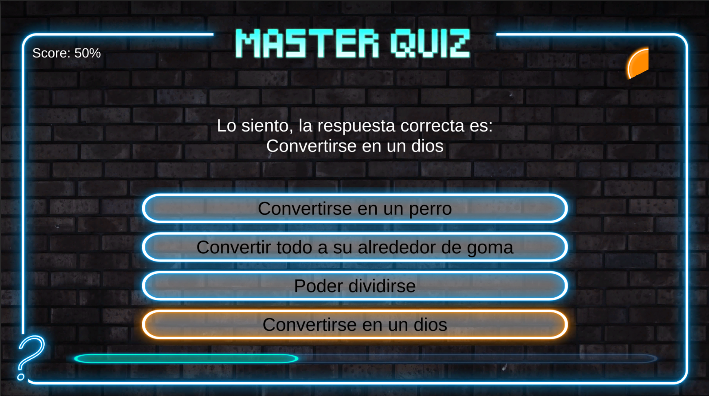
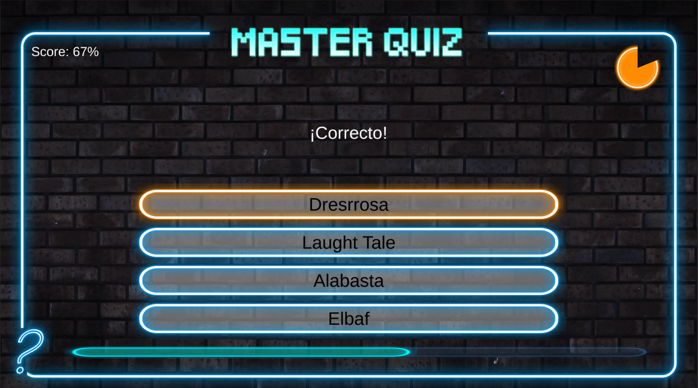
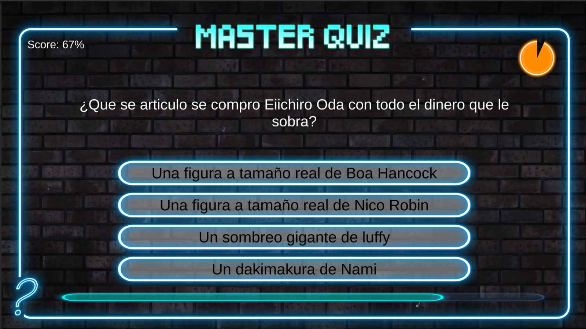

<h1>Quizz Game</h1>

A mini-game developed to better understand Unity UI while taking the GameDev course. 
This project was created for learning purposes.

If you wanna test it you can play it.
<h2>Controls</h2>
Left button mouse
<h2>Objective</h2>
End the quizz with 100% score

<h2>Image</h2>

